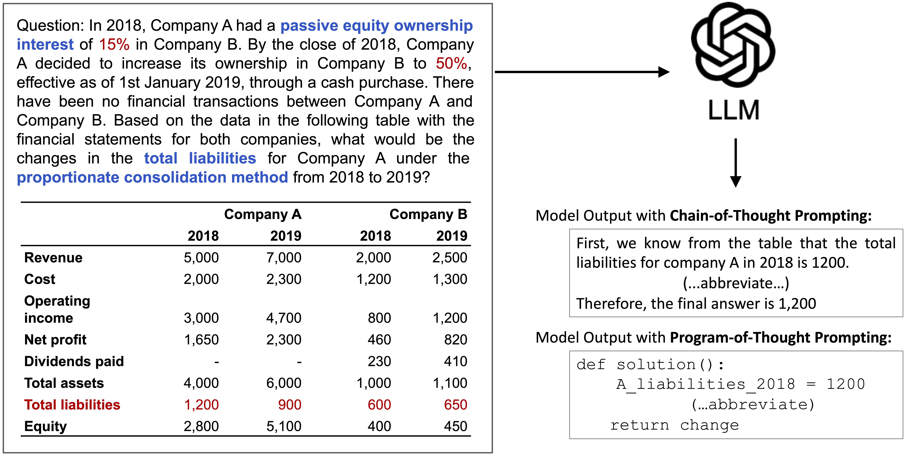

## KnowledgeMath
The data and code for the paper [KnowledgeMath: Knowledge-Intensive Math Word Problem Solving in Finance Domains](https://arxiv.org/abs/2311.09797). 
**KnowledgeMath** is a knowledge-intensive dataset focused on mathematical reasoning within the domain of finance. It requires the model to comprehend specialized financial terminology and to interpret tabular data presented in the questions. 
**KnowledgeMath** includes **1200 QA examples** across 7 key areas in finance. These examples were collected from financial experts and feature detailed solution annotations in Python format.

<p align="center">

</p>

## KnowledgeMath Dataset
All the data examples were divided into two subsets: *validation* and *test*.

- **validation**: 200 examples used for model development, validation, or for those with limited computing resources.
- **test**: 1000 examples for standard evaluation. We will not publicly release the annotated solution and answer for the test set.

You can download this dataset by the following command:

```python
from datasets import load_dataset

dataset = load_dataset("yale-nlp/KnowledgeMath")

# print the first example on the validation set
print(dataset["validation"][0])

# print the first example on the test set
print(dataset["test"][0])
```

The dataset is provided in json format and contains the following attributes:

```
{
    "question_id": [string] The question id,
    "question": [string] The question text,
    "tables": [list] List of Markdown-format tables associated with the question, 
    "python_solution": [string] Python-format and executable solution by financial experts. The code is written in a clear and executable format, with well-named variables and a detailed explanation,
    "ground_truth": [float] Executed result of `python solution`, rounded to three decimal places,
    "topic": [string] The related financial area of the question,
    "knowledge_terms": [list] List of knowledge terms in our constructed knowledge bank that is necessary to answer the given question. We will release this feature upon paper publication
}
```

## Experiments
### Environment Setup
The code is tested on the following environment:
- python 3.11.5
- CUDA 12.1, PyTorch 2.1.1
- run `pip install -r requirements.txt` to install all the required packages

### LLM Inference on KnowledgeMath
We provide inference scripts for running various LLMs on KnowledgeMath:
- `scripts/run_openai.sh` for running GPT-* models
- `scripts/run_gemini.sh` for running Gemini Pro
- `scripts/run_vllm.sh` for running all other open-sourced LLMs (e.g., Llama-2, Mistral, Falcon) that are reported in the paper and supported by the [vLLM](https://github.com/vllm-project/vllm) framework

### Model Output
The Chain-of-Thought (CoT) and Program-of-Thought (PoT) output from various LLMs on both the validation and test sets of **KnowledgeMath** can be found at the `outputs` directory.

### Automated Evaluation
We develop a heuristic-based method to automatically evaluate the accuracy of CoT and PoT outputs:
- `scripts/evaluate_cot_output.sh` for evaluating CoT outputs
- `scripts/evaluate_pot_output.sh` for evaluating PoT outputs

To get the results on the test set, please send your result json file to [this email](mailto:yilun.zhao@yale.edu) (see the leaderboard section below for more details).

## KnowledgeMath Leaderboard
The leaderboard is continuously being updated. To submit your results to leaderboard, please send your result json file on the test set to [this email](mailto:yilun.zhao@yale.edu). Please follow the format of the [sample submission file](https://github.com/yale-nlp/KnowledgeMath/outputs/test/raw_cot_outputs/gpt-4-0613.json).

## Contact
For any issues or questions, kindly email us at: Yilun Zhao (yilun.zhao@yale.edu).

## Citation

If you use the **KnowledgeMath** dataset in your work, please kindly cite the paper:

```
@misc{zhao2023knowledgemath,
      title={KnowledgeMath: Knowledge-Intensive Math Word Problem Solving in Finance Domains}, 
      author={Yilun Zhao and Hongjun Liu and Yitao Long and Rui Zhang and Chen Zhao and Arman Cohan},
      year={2023},
      eprint={2311.09797},
      archivePrefix={arXiv},
      primaryClass={cs.CL}
}
```
