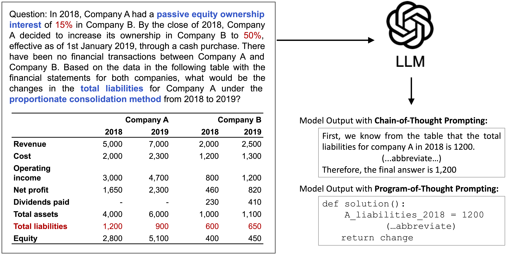

## FinanceMath
[**🌐 Homepage**](https://financemath-acl2024.github.io/) | [**🤗 Dataset**](https://huggingface.co/datasets/yale-nlp/FinanceMath) | [**📖 arXiv**](https://arxiv.org/abs/2311.09797) | [**GitHub**](https://github.com/yale-nlp/FinanceMath)

The data and code for the paper [FinanceMath: Knowledge-Intensive Math Reasoning in Finance Domains](https://arxiv.org/abs/2311.09797). 
**FinanceMath** is a knowledge-intensive dataset focused on mathematical reasoning within the domain of finance. It requires the model to comprehend specialized financial terminology and to interpret tabular data presented in the questions. 

<p align="center">

</p>

## FinanceMath Dataset
All the data examples were divided into two subsets: *validation* and *test*.

- **validation**: 200 examples used for model development, validation, or for those with limited computing resources.
- **test**: 1000 examples for standard evaluation. **Update (July 2026):** nearly three years after the initial release, the annotated `python_solution` and `ground_truth` for the test set are now publicly released as well, so both subsets can be evaluated locally.

You can download this dataset by the following command:

```python
from datasets import load_dataset

dataset = load_dataset("yale-nlp/FinanceMath")

# print the first example on the validation set
print(dataset["validation"][0])

# print the first example on the test set
print(dataset["test"][0])
```

The dataset is provided in json format and contains the following attributes:

```
{
    "question_id": [string] The question id,
    "question": [string] The question text,
    "tables": [list] List of Markdown-format tables associated with the question, 
    "python_solution": [string] Python-format and executable solution by financial experts. The code is written in a clear and executable format, with well-named variables and a detailed explanation,
    "ground_truth": [float] Executed result of `python solution`, rounded to three decimal places,
    "topic": [string] The related financial area of the question,
}
```

## Experiments
### Environment Setup
The code is tested on the following environment:
- python 3.11.5
- CUDA 12.1, PyTorch 2.1.1
- run `pip install -r requirements.txt` to install all the required packages

### LLM Inference on FinanceMath
We provide inference scripts for running various LLMs on FinanceMath:
- `scripts/run_api.sh` for running proprietary models. Note that we developed a centralized API proxy to manage API calls from different organizations and unify them to be compatible with the OpenAI API. If you use the official API platform, you will need to make some modifications.
- `scripts/run_vllm.sh` for running all other open-sourced LLMs (e.g., Llama, Mistral, QWen) that are reported in the paper and supported by the [vLLM](https://github.com/vllm-project/vllm) framework

### Model Output
The Chain-of-Thought (CoT) and Program-of-Thought (PoT) output from various LLMs on both the validation and test sets of **FinanceMath** can be found at the `outputs` directory.

### Automated Evaluation
We develop a heuristic-based method to automatically evaluate the accuracy of CoT and PoT outputs of both the validation and test sets:
- `scripts/evaluate_all.sh` for evaluating CoT and PoT outputs
- `scripts/evaluate_calculator.sh` for evaluating the CoT outputs with external calculator

Since the test set ground truth is now released, you can evaluate on both the `validation` and `test` sets locally: the scripts above read the annotations from `data/validation.json` and `data/test.json` respectively. PoT evaluation runs fully locally, whereas CoT and calculator-based evaluation additionally require a configured OpenAI-compatible API (set `api_base`/`api_key` in the scripts) for answer extraction. Submitting results by email is no longer required.

## Contact
For any issues or questions, kindly email us at: Yilun Zhao (yilun.zhao@yale.edu).

## Citation

If you use the **FinanceMath** dataset in your work, please kindly cite the paper:

```
@misc{zhao2024financemath,
      title={FinanceMath: Knowledge-Intensive Math Reasoning in Finance Domains}, 
      author={Yilun Zhao and Hongjun Liu and Yitao Long and Rui Zhang and Chen Zhao and Arman Cohan},
      year={2024},
      eprint={2311.09797},
      archivePrefix={arXiv},
      primaryClass={cs.CL},
      url={https://arxiv.org/abs/2311.09797}, 
}
```